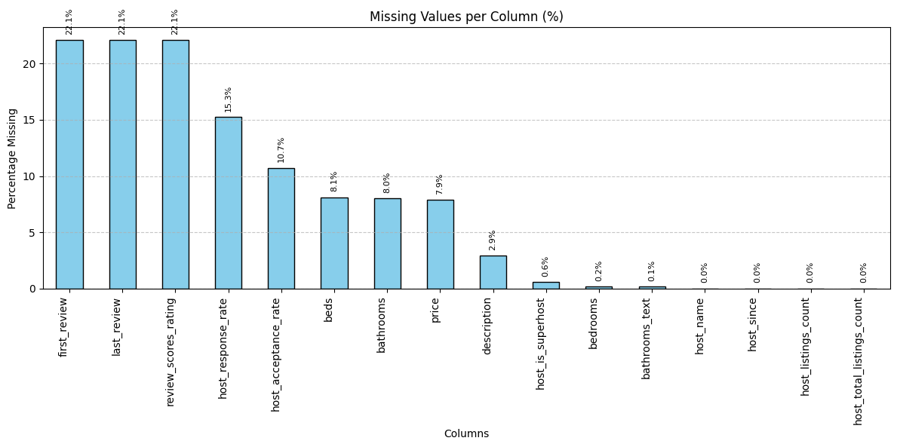
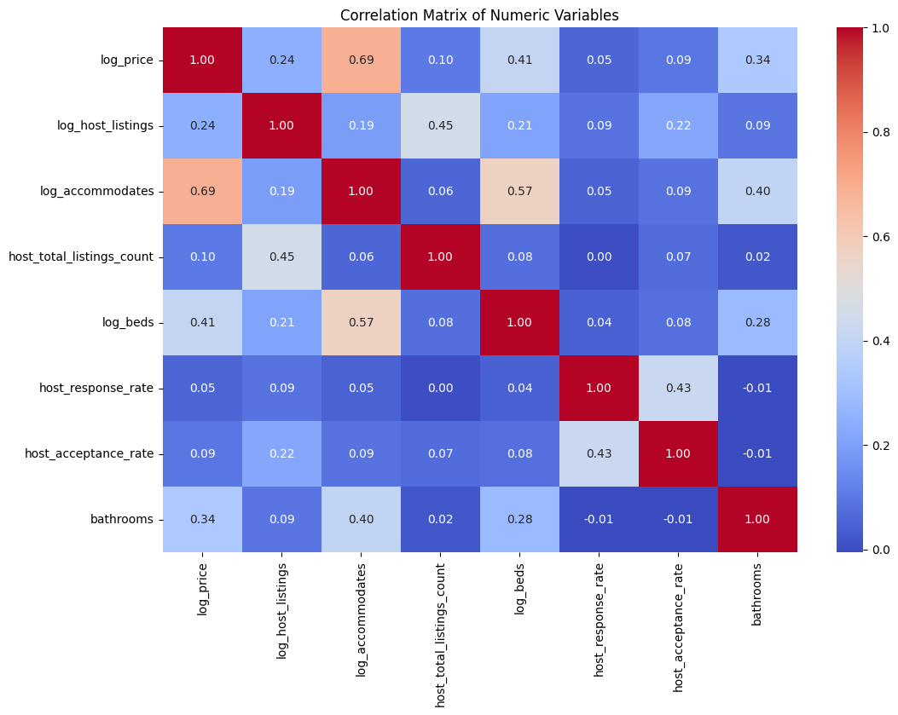
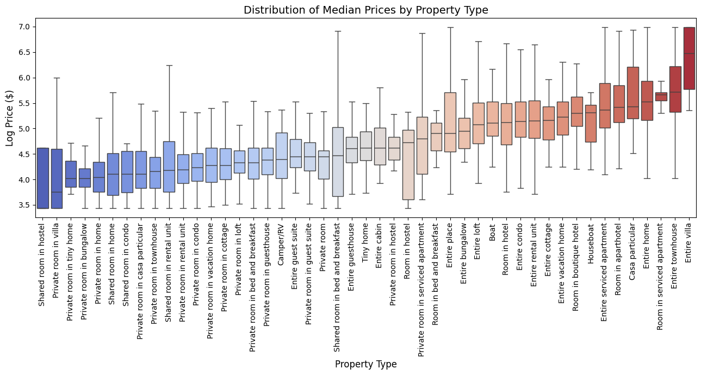
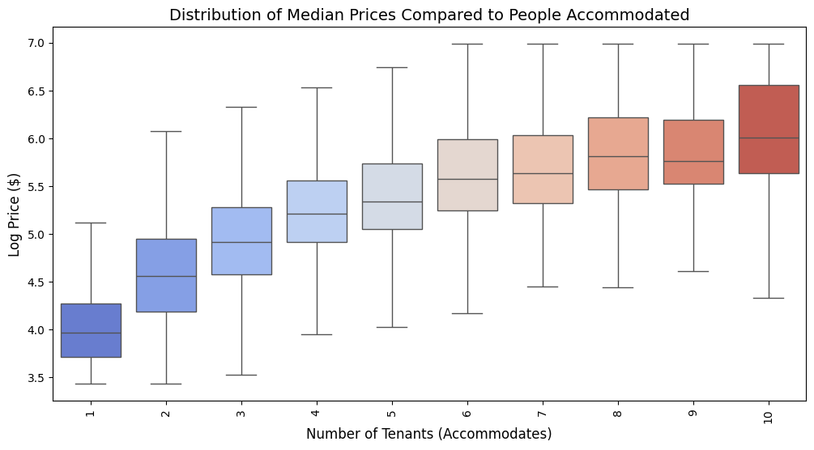
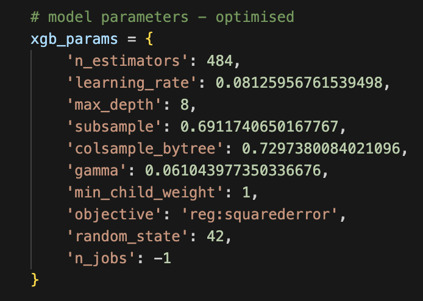

# 🏡 Airbnb Price Predictor

This project showcases a machine learning model that accurately predicts the listing price of Airbnb properties using publicly available data. The goal is to assist hosts in pricing their listings competitively and fairly through data exploration, preprocessing, and the development of an XGBoost-based model. The resulting model demonstrates strong performance, generalizing well to new data and capturing much of the variance in listing prices, making it a useful tool for property pricing.

## 📌 Overview

Airbnb hosts often face challenges in setting competitive prices that balance profitability with demand. Overpricing can lead to fewer bookings, while underpricing may result in lost income. This project takes a data-driven approach to address that challenge by developing a robust machine learning model that predicts Airbnb listing prices based on key features such as location, number of bedrooms, amenities, availability, and user reviews.

By providing data-informed pricing recommendations, the model empowers hosts to optimize their pricing strategies, stay competitive in the market, and ultimately maximize revenue.

## 📊 Data Sources & Structure

**Source**: https://www.kaggle.com/datasets/whenamancodes/london-uk-airbnb-open-data/data

**City**: London

**Size**: 66,679 rows & 18 columns

## 📈 Exploratory Data Analysis (EDA)

Exploratory Data Analysis (EDA) was conducted to uncover key trends, patterns, and relationships within the data. This step helped guide feature engineering and informed modelling decisions by identifying variables with strong potential to influence price.

The following are some examples of visualisations created to support this analysis:

## 🧹 Data Cleaning and Preprocessing

**Data Formatting**: Correcting data format, including date, money, and correcting data types.

**Dropping Columns**: Columns with low predictive power were dropped to keep the data focused and prevent noise.

**Missing Values**: Took a nuanced approach, using different methods for different columns, including removal, median filling, and flagging.

**Feature Transformation**: Numerical feature which showed large variance were log-transformed to make them easier to handle.

**Outlier Handling**: Features with a high number of outliers were winsorized to prevent skewed data.

**Feature Engineering**: Current features were used to extrapolate new, innovative features to boost model performance.

**Feature Encoding**: Converted categorical features to numerical equivalents for the model to use.

## 🤖 Model Building

To accurately predict listing prices, an XGBoost Regressor was chosen as the primary model. XGBoost is a powerful gradient boosting algorithm known for its:

- Excellent performance on structured/tabular data

- Built-in regularization to reduce overfitting

- Fast training speeds and scalability

- Ability to handle missing data natively

To maximize model performance, hyperparameters were tuned using RandomizedSearchCV, a faster and more efficient alternative to exhaustive grid search. The tuning process involved searching over a wide range of values to find the best combination of parameters based on 5-fold cross-validation R² scores.

## 💪 Model Training & Evaluation Process

To ensure reliable model performance, all relevant engineered features were used while carefully removing price-related variables from the dataset to prevent data leakage. The target variable 'log_price' was selected to reduce skewness and improve generalisation.

The dataset was first split using a standard 80/20 train-test split to validate performance on unseen data. During model development, 5-fold cross-validation was applied on the training set to assess generalisability and tune parameters.

Finally, the model was trained on the full training set and evaluated on the test set using several performance metrics to gauge its effectiveness on real-world, unseen data.

## 🔬 Model Results

To evaluate how accurately the model can predict Airbnb listing prices, several standard testing methods were used. Here's what we found:

**Cross-Validation Results**

Cross-validation is a technique where the model is tested across multiple subsets of the data. This helps assess how well the model generalizes to different scenarios and avoids overfitting.

- R² Scores: [0.8702, 0.8641, 0.8735, 0.8669, 0.8694]

- Mean R²: 0.8688

- Standard Deviation: 0.0032 (very low, indicating consistent performance)

**Final Performance (Real Price Scale)**

The model was trained and evaluated on the log of the price (log_price) to improve stability and performance. To interpret the results in real-world terms, predictions were converted back to the actual price scale.

| Metric                  | Value    | Explanation                                                                 |
|-------------------------|----------|-----------------------------------------------------------------------------|
| RMSE (avg. £ error)     | £35.72   | On average, the model’s predictions are about £35 off from actual prices. (excellent for real estate)  |
| MAPE (avg. % error)     | 12.87%   | Predictions are, on average, within ~13% of the actual price.              |
| R² (accuracy score)     | 0.8723   | Indicates strong accuracy—about 87% of the variation in prices is captured.|

## 📝 Summary

This XGBoost model demonstrates high accuracy, low variance, and strong generalization to new, unseen data. By combining effective feature engineering, careful data preprocessing, and thorough model tuning, the final pipeline delivers reliable and interpretable price predictions—useful for helping Airbnb hosts set competitive and realistic listing prices.

